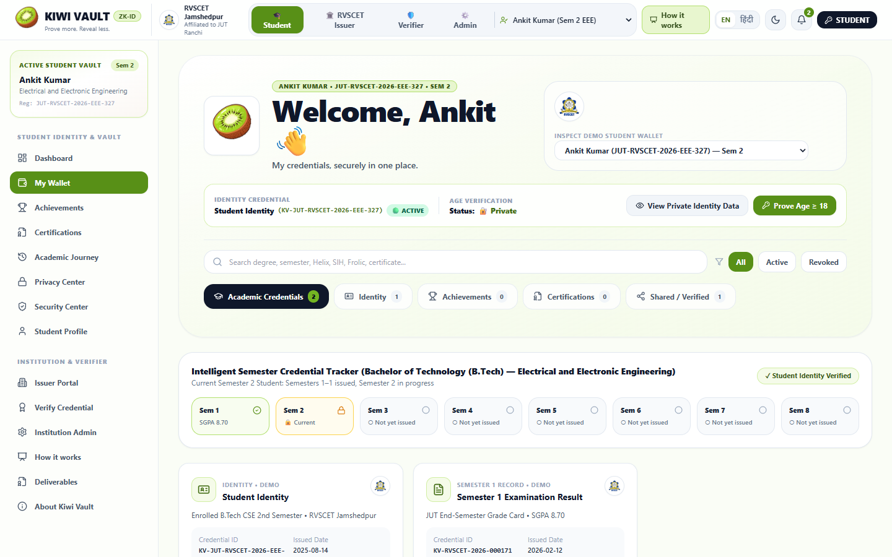
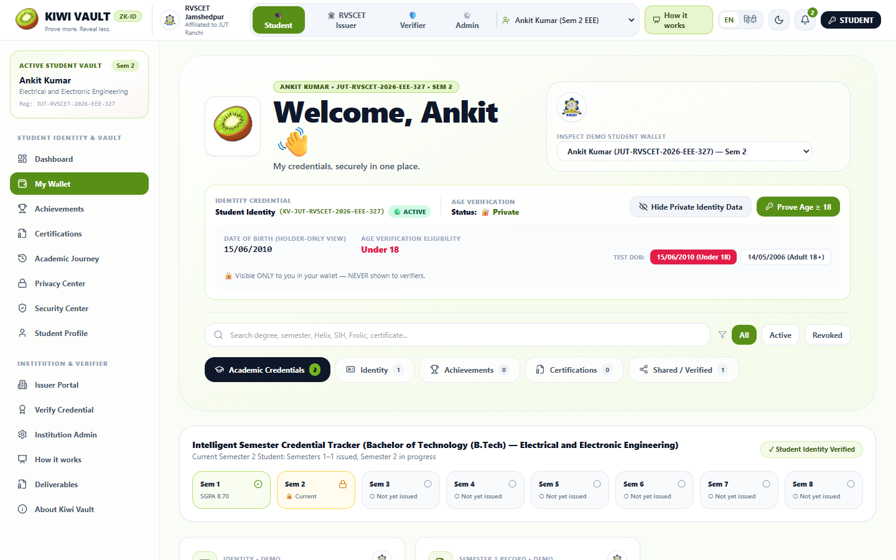
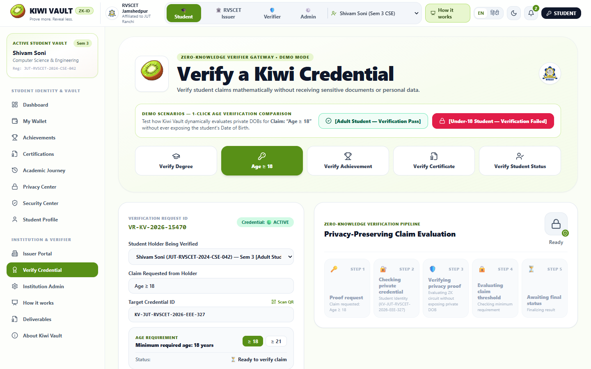
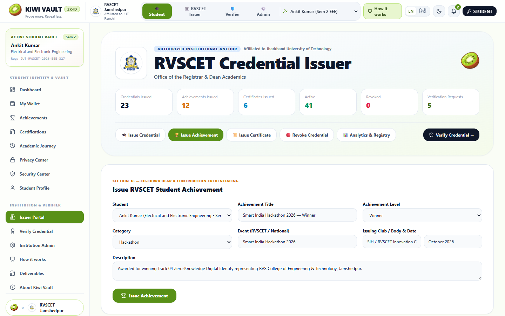
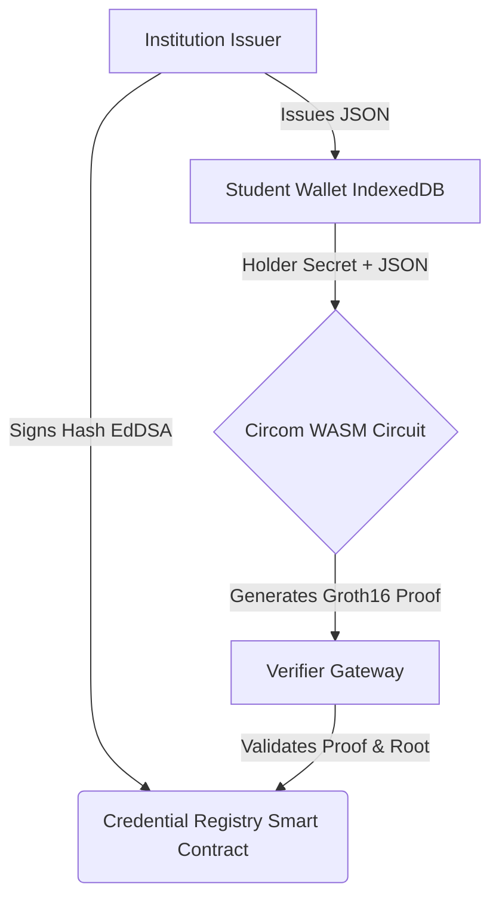

<div align="center">
  
  <h1>🥝 KIWI VAULT</h1>
  <p><strong>Your Credentials. Your Achievements. Your Privacy.</strong></p>
  
  [](https://nextjs.org/)
  [](https://docs.circom.io/)
  [](https://soliditylang.org/)
  [](https://hardhat.org/)
  [](https://tailwindcss.com/)
  [](https://opensource.org/licenses/MIT)

  <p>
    <em>Developed for <strong>HackQubit 2.0</strong> (Problem 23 | Track 04: Zero-Knowledge ID) by <strong>Team Nexus</strong></em>
  </p>
</div>

<br />

## 📖 Table of Contents
- [About the Project](#-about-the-project)
- [The Problem vs. Our Solution](#-the-problem-vs-our-solution)
- [Key Features](#-key-features)
- [Ecosystem Navigation](#-ecosystem-navigation)
- [Screenshots & UI Walkthrough](#-screenshots--ui-walkthrough)
- [Technical Architecture](#-technical-architecture)
- [Getting Started (Local Setup)](#-getting-started-local-setup)
- [Project Structure](#-project-structure)
- [Team](#-team)

---

## 🚀 About the Project

**Kiwi Vault** is an institutional Zero-Knowledge (ZK) credentialing prototype designed for **RVS College of Engineering & Technology (RVSCET), Jamshedpur**. 

It enables institutions to issue cryptographic digital credentials to students, and allows those students to prove specific attributes (like their age or degree status) to third parties **without exposing the underlying raw data** (like Date of Birth or Aadhaar number).

---

## ⚡ The Problem vs. Our Solution

### The Problem (Problem 23)
Traditional credential verification forces students to hand over complete physical or PDF documents. Sharing an Aadhaar card or Marksheet exposes an incredible amount of Personally Identifiable Information (PII) that is vulnerable to data breaches, leaks, and identity theft.

### Our Solution
Using **zk-SNARKs (Groth16)** and **Merkle Trees**, Kiwi Vault separates private records from public cryptographic claims:
- Prove you are **`Age >= 18`** without revealing your **exact Date of Birth**.
- Prove you are a **`B.Tech CSE Student`** without revealing your **Roll Number or Grades**.
- Prove you are a **`Hackathon Winner`** without sharing the entire PDF certificate.

---

## ✨ Key Features

- 🔐 **Client-Side ZK Proof Generation:** Students generate proofs directly in their browsers using WebAssembly (WASM). No private data ever leaves the device.
- 📱 **Smart QR Code Verification:** Built-in live camera scanner in the Verifier portal auto-detects credential types and dynamically verifies claims instantly.
- 🌳 **On-Chain Revocation Registry:** Uses an incremental Merkle Tree anchored to a Solidity smart contract to handle credential revocation.
- 💳 **Encrypted Local Wallet:** IndexedDB powered encrypted storage for student credentials.
- 📊 **Dynamic Technical Dashboard:** A dedicated `/technical` route exposing the cryptographic matrices, contract addresses, and real-time verifiable architecture.

---

## 🧭 Ecosystem Navigation

Kiwi Vault consists of three main portals, accessible directly from the homepage:

1. **🏛️ Issuer Portal (`/issuer`)**
   - *Role:* University Registrars / Hackathon Organizers.
   - *Action:* Issue cryptographically signed (EdDSA) credentials, anchor the Merkle Root on-chain, and manage revocations.
2. **🎓 Student Wallet (`/wallet` & `/dashboard`)**
   - *Role:* Students / Graduates.
   - *Action:* Store credentials safely, manage privacy settings, and generate ZK-proof QR codes for verifiers.
3. **🛡️ Verifier Gateway (`/verifier`)**
   - *Role:* Recruiters / Event Organizers / Age-restricted platforms.
   - *Action:* Scan QR codes using the device camera to cryptographically verify claims without seeing the student's raw data.

---

## 📸 Screenshots & UI Walkthrough


| Student Wallet Dashboard | ZK Proof Generation |
| :---: | :---: |
|  |  |
| *View and manage encrypted credentials locally.* | *Mathematical proving happening in the browser.* |

| Verifier QR Scanner | Issuer Portal |
| :---: | :---: |
|  |  |
| *Live QR scanning to verify claims.* | *Issue and revoke credentials on-chain.* |

---

## 🏗️ Technical Architecture



- **Frontend:** Next.js 14, React, Tailwind CSS, Framer Motion
- **Web3 & ZK:** SnarkJS, CircomlibJS, Ethers.js
- **Backend/Contracts:** Hardhat, Solidity (Polygon Amoy / Ethereum Sepolia compatibility)
- **Circuits:** `age.circom`, `degree.circom` compiled to `.wasm` and `.zkey`

---

## 💻 Getting Started (Local Setup)

To run the full stack locally (Frontend + Blockchain Hardhat Node):

### Prerequisites
- Node.js (v18 or v20+)
- Git

### 1. Clone the Repository
```bash
git clone https://github.com/Ankitcore/KiwiVault.git
cd KiwiVault
```

### 2. Start the Local Blockchain (Backend)
Open a terminal and run the local Hardhat node:
```bash
cd backend
npm install
npx hardhat node
```
*Note: This will deploy the registry and verifier contracts automatically and start a local RPC server on `http://127.0.0.1:8545`.*

### 3. Start the Web App (Frontend)
Open a **new terminal window** and run the Next.js app:
```bash
cd frontend
npm install
npm run dev
```

### 4. Open the App
Visit [http://localhost:3000](http://localhost:3000) in your browser.

---

## 📁 Project Structure

```text
KiwiVault/
├── backend/                   # Smart Contracts & ZK Circuits
│   ├── circuits/              # Circom files (age.circom, degree.circom)
│   ├── contracts/             # Solidity files (CredentialRegistry.sol, KiwiVerifier.sol)
│   ├── scripts/               # Hardhat deployment scripts
│   └── setup_circuits.js      # ZK Trusted Setup & compilation pipeline
│
└── frontend/                  # Next.js Application
    ├── app/                   # App Router Pages (/wallet, /verifier, /issuer, /technical)
    ├── components/            # Reusable UI components & animated cards
    ├── lib/                   # Core logic (zk/engine.ts, auth/vault-context.tsx)
    ├── public/zk/             # Compiled WASM & ZKey files for client-side proving
    └── config/                # Deployed contract addresses (contracts.json)
```

---

## 👥 Team Members

Built with ❤️ for **HackQubit 2.0**.

- **Ankit Kumar** — Full Stack Engineer & Idea Lead
- **Shivam Soni** — Bug Hunter & Site Optimization
- **Siddharth Gupta** — PPT & Pitch Lead
- **Abhieshik** — Frontend Developer

---
<div align="center">
  <p><i>Empowering privacy-first digital identities on Web3.</i></p>
</div>
